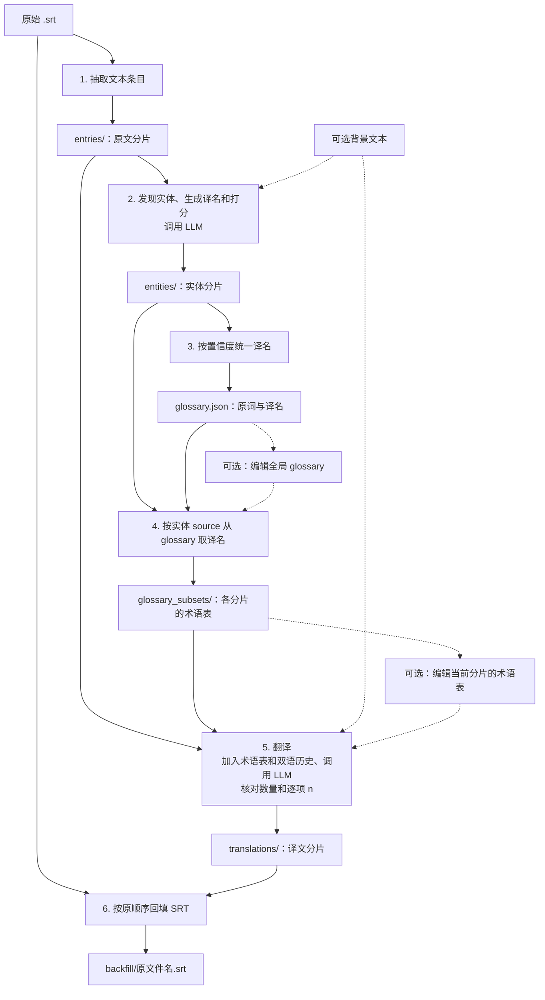

# SRT 字幕文件翻译工具实现方案

## 1. 目标与首版范围

实现一个 Python 命令行工具，通过 OpenAI Compatible API（兼容 OpenAI Chat Completions 接口），将 SRT 字幕翻译为用户指定的语言。

六阶段流程：

**抽取文本条目 → 发现实体、生成译名和打分 → 构建全局 glossary → 按实体分片生成 glossary 子集 → 翻译 → 回填 SRT。**



默认连续执行六阶段，也可执行到任意阶段停止，编辑产物后继续。

首版约定：

- 每次处理一个 SRT，分片同步、串行、非流式执行，不使用 Batch API。
- 源语言由 `--source-lang` 指定，目标语言由 `--target-lang` 指定（默认 `--target-lang`  为 `zh-Hans`）。
- 程序不限定语言列表；语言参数传给 LLM。具体语言的翻译质量取决于模型。
- 实体发现始终生成目标语言的建议译名。
- 翻译默认按 glossary 子集中的译名；指定 `--no-translate-glossary` 后，不再翻译 glossary 子集中的术语。
- 用户可以编辑任何阶段的产物，包括全局 glossary、单个 glossary 子集和译文分片。编辑后保持文件结构，并按第 10 节清理需要重新生成的下游文件。
- 输出父目录默认为当前工作目录，可通过 `--output-dir` 指定；始终在其中按原文件主名、源语言和目标语言生成任务目录。
- **文件存在即跳过生成。** 用户自行清理过期或损坏的产物。
- 信任 LLM 正常完成的结构化输出，不重复做本地 Schema 校验。
- 每片译文在落盘之前核对数量和逐项 n。
- 各阶段只处理实际存在的输入分片，不自动补齐上游分片；用户负责按阶段顺序完成任务。
- 译文的换行由 LLM 按目标语言安排；提示词要求保留 URL、HTML 标签及属性、ASS 控制块和音乐符号，可见文本正常翻译。
- 原 SRT 视为合法输入，使用库解析；不修改原文件。
- 不引入 hash、自动失效传播、原子写入、业务重试、自动修复、别名归并或一词多义判断。

## 2. 技术选型、安装与项目结构

### 2.1 技术选型

- Python 3.11 或更高版本。
- `openai`：调用 `client.chat.completions.create`。
- `pydantic>=2,<3`：校验配置，以及定义响应字段并生成 JSON Schema。
- `platformdirs>=4`：确定用户配置目录。
- `srt`：解析和生成 SRT。
- 标准库 `argparse`、`pathlib`、`json`、`time`、`tomllib`、`importlib.resources`。
- `pytest`：单元测试、集成测试及真实 API 测试。

依赖统一声明在 pyproject.toml。项目名、发行包名、CLI 工具名和用户配置目录名使用 `srt-translate`，Python 包名为 `srt_translate`。包内默认配置命名为 `config.default.toml`，用户配置命名为 `config.toml`。

### 2.2 安装与入口

建议使用 .venv 虚拟环境。

在项目根目录中执行以下 PowerShell 命令。若已有可用的 .venv，跳过创建步骤：

```powershell
python -m venv .venv
.\.venv\Scripts\Activate.ps1
```

然后选择一种安装方式：

| 用途 | 命令 | 修改源码后 |
| --- | --- | --- |
| 开发或个人维护，推荐 | `python -m pip install -e .` | 通常直接生效；更改依赖或入口配置后需重新安装 |
| 普通安装 | `python -m pip install .` | 需重新安装 |

开发时安装测试依赖：

```powershell
python -m pip install -e ".[dev]"
```

不激活环境也可以直接使用其解释器，例如：

```powershell
.\.venv\Scripts\python.exe -m pip install -e .
.\.venv\Scripts\python.exe -m srt_translate --help
```

激活环境后，以下两个入口行为一致，均调用 `srt_translate.cli:main`：

```console
srt-translate --help
python -m srt_translate --help
```

### 2.3 目录结构

以下展示英文字幕文件 `Blood.of.Zeus.S01E01.srt` 翻译为简体中文的产物：

```text
./
├── .venv/
├── Blood.of.Zeus.S01E01__en_to_zh-Hans/    # 自动生成的任务目录 task_dir
│   ├── entries/
│   │   ├── 000001_000020.json
│   │   └── ...
│   ├── entities/
│   │   ├── 000001_000020.json
│   │   └── ...
│   ├── glossary.json
│   ├── glossary_subsets/
│   │   ├── 000001_000020.json
│   │   └── ...
│   ├── translations/
│   │   ├── 000001_000020.json
│   │   └── ...
│   └── backfill/
│       └── Blood.of.Zeus.S01E01.srt
├── examples/
│   ├── 1997 スペシャルおまけビデオ.srt
│   └── Blood.of.Zeus.S01E01.srt
├── src/
│   └── srt_translate/
│       ├── __init__.py
│       ├── __main__.py
│       ├── cli.py                        # 参数、客户端和阶段调度
│       ├── config.py                     # API 配置加载与校验
│       ├── config.default.toml          # 打包到应用资源的默认配置
│       ├── schemas.py                    # 响应 Schema
│       ├── common.py                     # JSON、文件路径和 SRT 读写
│       ├── llm.py                        # 调用前等待、同步请求、JSON 解析
│       ├── prompts.py
│       ├── phase_extract_entries.py
│       ├── phase_discover_entities.py
│       ├── phase_build_glossary.py
│       ├── phase_generate_glossary_subsets.py
│       ├── phase_translate.py
│       └── phase_backfill.py
├── tests/
│   ├── unit/
│   ├── integration/
│   └── live/
├── test_outputs/                         # 真实 API 测试产物，保留供调试
│   └── live/
│       └── <run_id>/
│           └── <case_name>/
├── pyproject.toml
├── PLAN.md
└── README.md
```

CLI 的 `--output-dir` 指输出父目录，`task_dir` 指其中自动生成的任务目录。同一个分片在各目录中使用完全相同的 JSON 文件名，目录名表示产物类型。backfill 目录中的 SRT 即为最终产物，保留原 SRT 文件名。

### 2.4 各阶段的模块职责

| 模块 | 输入与职责 | 输出 |
| --- | --- | --- |
| `phase_extract_entries.py` | 解析原 SRT，提取 n 和 text，按出现顺序分片 | entries 分片 |
| `phase_discover_entities.py` | 逐片读取 entries，请求 LLM 抽取实体、分类、生成译名和打分 | 同名 entities 分片 |
| `phase_build_glossary.py` | 汇总 entities，按 source 分组，选择平均置信度最高的译名 | glossary.json |
| `phase_generate_glossary_subsets.py` | 读取各 entities 分片的 source，从 glossary 取得统一译名 | 同名 glossary_subsets 分片 |
| `phase_translate.py` | 读取 entries、同名 glossary 子集和双语历史，请求 LLM 翻译；核对数量和逐项 n 后落盘 | 同名 translations 分片 |
| `phase_backfill.py` | 按分片顺序汇总译文，按原字幕顺序替换正文并保存 | backfill 目录中的 SRT |

各阶段的模块之间不直接调用；通过明确的文件输入/输出契约解耦；只要输入满足契约，就可以被单独测试。

## 3. 通用数据与文件约定

### 3.1 字幕编号和分片

- `n` 直接保留原 SRT 编号，不重新编号。假定输入合法，不额外检查原编号的类型、正负或唯一性。

- 条目位置指字幕在原文件中的出现位置，从 1 开始连续计数。

- 按出现顺序，每 chunk-size 条分片；尾片可以不足该数量。

- 文件名为 `<起始条目位置>_<结束条目位置>.json`，包含两端。宽度统一为 `max(6, len(str(total_entries)))`，不足补零。

- 原 SRT 可能存在跳号或不按数值递增

  例如，原编号 10、20、35 的三个条目，分片大小为 2 时，写入 `000001_000002.json` 和 `000003_000003.json`，文件内 n 仍为 10、20、35。

同一任务中按文件名排序就是分片顺序；文件内数组保留字幕出现顺序。各阶段从相应目录读取 JSON 分片。

### 3.2 编码与换行

- 原 SRT 默认以 `utf-8-sig` 解码，兼容 UTF-8 带 BOM 和不带 BOM；其他编码通过 `--input-encoding` 指定。
- 背景文件用 `utf-8-sig` 解码；未提供时 background 为 `""`。
- 内部正文使用 `\n` 表示换行，由 JSON 编码器转义。
- 所有输出文件使用 UTF-8 without BOM。
- JSON 使用 `ensure_ascii=False`、两空格缩进和 LF 文件换行。
- 输出 SRT 使用 CRLF，即 `\r\n`。
- SRT 字幕允许换行，译文的行数和换行位置可以不同于原文。

### 3.3 本地文件结构

| 产物 | 顶层结构 | 内容 |
| --- | --- | --- |
| entries 分片 | 数组 | `{"n": 原编号, "text": 原文}` |
| entities 分片 | 数组 | 第 5.2 节规定的九字段实体 |
| glossary.json | 对象 | 原词到译名的映射 |
| glossary_subsets 分片 | 对象 | 对应 entities 分片的 source 在全局 glossary 中的键值 |
| translations 分片 | 数组 | `{"n": 原编号, "text": 译文}` |

实体数组、全局 glossary 和 glossary 子集可以为空。

术语表的键为原词，值为用户希望使用的译名（值也可以是原词本身或其他语言的字符串，程序不判断译名是否“正确”）。

API 响应的顶层为对象，解析后取出数组落盘，见第 9 节。

## 4. CLI、配置和阶段接口

### 4.1 CLI 参数

```text
srt-translate INPUT_SRT --source-lang LANG [--target-lang LANG] [OPTIONS]
```

| 参数 | 默认值 | 说明 |
| --- | --- | --- |
| `INPUT_SRT` | 必填 | 原始 SRT 路径 |
| `--source-lang LANG` | 必填 | 源语言的 BCP 47 标签，如 en、ja、fr、ar |
| `--target-lang LANG` | `zh-Hans` | 目标语言的 BCP 47 标签，如 en、ja、zh-Hans、zh-Hant、pt-BR |
| `--background PATH` | 不提供 | 可选背景文件，通常约 100 个 token |
| `--output-dir PATH` | 当前工作目录 | 输出父目录；始终在其下生成 `<stem>__<source_lang>_to_<target_lang>/` 任务目录 |
| `--config-file PATH` | 不提供 | 按字段覆盖内置配置和用户配置，优先级最高 |
| `--input-encoding NAME` | `utf-8-sig` | 原 SRT 解码方式 |
| `--chunk-size N` | `20` | 正整数，仅抽取阶段使用 |
| `--history-size N` | `5` | 非负整数；0 表示禁用历史 |
| `--no-translate-glossary` | `False` | 指定后 glossary 子集所列术语统一保留原词 |
| `--delay-between-requests SECONDS` | `0` | 每次模型调用前等待的秒数，支持小数，必须为非负有限数 |
| `--from-stage NAME` | `extract` | 从指定阶段开始，包含该阶段 |
| `--to-stage NAME` | `backfill` | 执行到指定阶段，包含该阶段 |

**输出父目录与任务目录：**

- CLI 的 output-dir 默认值为 `Path(".")`，表示当前工作目录；省略参数与显式 `--output-dir ./` 等价。
- 任务目录为 `args.output_dir / f"{input_srt.stem}__{source_lang}_to_{target_lang}"`。例如 `Blood.of.Zeus.S01E01.srt`、en、zh-Hans 默认在当前工作目录下生成 `Blood.of.Zeus.S01E01__en_to_zh-Hans/`。
- 显式指定 `--output-dir PATH` 时，在 PATH 内追加同样的任务目录名，不直接把产物放在 PATH 中。
- 相对路径基于当前工作目录解析。各阶段使用同一个已计算的 task_dir；相同参数从中途继续时得到相同目录。
- 不同目录中的同名 SRT、使用相同语言组合时仍会得到同一任务目录；这种情况下，用户应使用不同的输出父目录分开。首版不引入路径 hash。

语言参数应使用 BCP 47 语言标签。程序只检查非空及允许的文件名字符（ASCII 字母、数字和连字符），不实现完整语法校验或注册表查询。标签原样传入提示词，并用于任务目录名。

默认使用 `zh-Hans`，直接指定简体中文；`zh-CN` 中的 CN 表示地区。若需要同时指定简体字和中国大陆用语，可使用 `zh-Hans-CN`。参见 [W3C 语言标签说明](https://www.w3.org/International/articles/language-tags/)和 [RFC 5646 示例](https://www.rfc-editor.org/rfc/rfc5646.html#appendix-A)。

请求字段仍命名为 source_lang 和 target_lang，分别表示源语言和目标语言。两类提示词都说明字段值是 BCP 47 标签，并给出常见示例；不增加标签到语言全称的自动映射。

`--no-translate-glossary` 的内部变量名为 `no_translate_glossary`：

- 未指定时为 False，使用 glossary 子集中的译名；
- 指定时为 True，保留术语原词。

`--delay-between-requests` 对应内部参数 `delay_between_requests`，默认 0.0，单位为秒；实体发现和翻译共用这个参数。

阶段顺序：

```text
extract → discover → glossary → subsets → translate → backfill
```

from-stage 不得晚于 to-stage。只执行选定区间，不自动补跑前置阶段。各阶段只处理自己输入目录中实际存在的分片，不依据原 SRT 或其他目录推断是否缺片；用户负责准备齐全的上游产物。

实际读取某个明确需要的文件时，如果文件不存在则直接报错。例如翻译某个 entries 分片时需要其同名 glossary子集；子集文件缺失会报错，而内容为 `{}` 则可以正常使用。缺片处理范围见第 10.1 节。

INPUT_SRT 和 source-lang 始终必填。CLI 用原文件主名和语言参数确定任务目录；两个模型阶段接收 source-lang 和 target-lang。各阶段按自己的输入参数工作。

### 4.2 用法

英文翻译为简体中文，运行全部阶段：

```console
srt-translate "examples/Blood.of.Zeus.S01E01.srt" --source-lang en
```

日文翻译为英文，显式指定输出父目录：

```console
srt-translate "examples/1997 スペシャルおまけビデオ.srt" --source-lang ja --target-lang en --output-dir outputs_ja_en
```

先生成全局 glossary，供人工检查或编辑：

```console
srt-translate "examples/Blood.of.Zeus.S01E01.srt" --source-lang en --to-stage glossary
```

编辑全局 glossary 后，从 glossary 子集阶段继续：

```console
srt-translate "examples/Blood.of.Zeus.S01E01.srt" --source-lang en --from-stage subsets
```

只生成子集，供人工逐片编辑：

```console
srt-translate "examples/Blood.of.Zeus.S01E01.srt" --source-lang en --from-stage subsets --to-stage subsets
```

已有子集，从翻译继续，但保留术语原文：

```console
srt-translate "examples/Blood.of.Zeus.S01E01.srt" --source-lang en --from-stage translate --no-translate-glossary
```

删除旧 SRT 产物后，只重新回填：

```console
srt-translate "examples/Blood.of.Zeus.S01E01.srt" --source-lang en --from-stage backfill
```

每次模型调用前等待 1.5 秒：

```console
srt-translate "examples/Blood.of.Zeus.S01E01.srt" --source-lang en --delay-between-requests 1.5
```

注：分阶段运行时，用户需自行保持语言、背景、输出目录等参数一致。若已有需要更新的下游产物，先按第 10 节删除，再运行对应命令。

### 4.3 API 配置

使用 UTF-8 TOML，应用资源内的 `config.default.toml` 提供基础默认值：

```toml
[openai]
base_url = "http://127.0.0.1:8317/v1"
api_key = "123456"
model = "gemini-3.8-flash-high"
max_retries = 2
```

`config.py` 的 `load_config(config_file=None)` 在每次命令执行时按以下顺序加载：

1. 用 `importlib.resources` 读取 Python 包 `srt_translate` 内的 `config.default.toml`，该文件通过 package-data 打包。
2. 用 `platformdirs.user_config_path("srt-translate", appauthor=False) / "config.toml"` 定位用户配置；不存在时跳过，不创建文件。
3. 读取 `--config-file PATH` 指定的文件；相对路径基于当前工作目录，显式指定但不存在时报错。

按 `[openai]` 内的字段逐层覆盖，未声明的字段保留前一层的值。首版只配置以上四项，其他翻译参数继续由现有 CLI 参数提供，不自动搜索当前目录配置。

每层在合并时严格校验：前三项为非空字符串，`max_retries` 为非负整数；未知表、未知字段、类型错误、TOML 语法错误和读取失败都会报告配置路径。更高优先级配置不能掩盖低优先级文件中的错误。

CLI 在任何阶段执行前加载并验证配置，配置错误以退出码 2 停止，不生成任务产物；`--help` 不读取配置。API 客户端仍只在模型阶段按需创建。生效的 `base_url`、`api_key`、`max_retries` 传入客户端，`model` 传给实体发现和翻译。

例如用户配置只写 `api_key`，显式文件只写 `model`，最终分别保留这两个覆盖值，另外两项沿用内置默认值。

### 4.4 阶段接口

路径使用 Path，返回产物路径；client 可替换为假客户端：

```text
extract_entries(
    input_srt, entries_dir, *, chunk_size=20, input_encoding="utf-8-sig"
) -> list[Path]

discover_entities(
    entries_dir, entities_dir, *, source_lang, target_lang,
    client, model, background_path=None, delay_between_requests=0.0
) -> list[Path]

build_glossary(
    entities_dir, glossary_path
) -> Path

generate_glossary_subsets(
    entities_dir, glossary_path, glossary_subsets_dir
) -> list[Path]

translate(
    entries_dir, glossary_subsets_dir, translations_dir, *,
    source_lang, target_lang, client, model, background_path=None,
    history_size=5, no_translate_glossary=False, delay_between_requests=0.0
) -> list[Path]

backfill(
    input_srt, translations_dir, output_srt, *, input_encoding="utf-8-sig"
) -> Path
```

## 5. 阶段 1～3：抽取、发现实体、构建 glossary

### 5.1 阶段 1：抽取文本条目

1. 解码原 SRT，通过 `list(srt.parse(text, ignore_errors=False))` 读取。
2. 保持原出现顺序，生成 `{"n": subtitle.index, "text": subtitle.content}`。
3. 按条目位置分片，写入尚不存在的 entries 文件。

例如，以下三个条目在 chunk-size 为 3 时生成 `000001_000003.json`：

```json
[
  {"n": 251, "text": "You won't be here forever."},
  {"n": 252, "text": "[Elias] Alexia's right. War is upon us.\nWe must prepare."},
  {"n": 253, "text": "[Heron] How?"}
]
```

注：原 SRT 有可能出现 n 不从 1 开始，尽管这种情况很罕见。

### 5.2 阶段 2：发现实体、分类、译名和打分

每个 entries 分片对应一个同名 entities 文件。存在则跳过；不存在时请求模型，解析响应并保存 entities 数组。

实体发现始终生成 target-lang 指定语言的建议译名，与后续是否保留术语原词无关。

九个必填字段：

| 字段 | 约定 |
| --- | --- |
| `source` | 原文中出现的词，保留原表记，去掉两端空白 |
| `context` | 支持识别和分类的简短原文片段 |
| `reasoning` | 一句简短的英文，说明实体是什么，以及分类或译名依据 |
| `type` | 模型自由生成的简短英文类别 |
| `subtype` | 更具体的简短英文类别 |
| `translation` | 目标语言的建议译名；适合保留原词时可与 source 相同 |
| `entity_confidence` | 0～1，值得抽取为统一术语的置信度 |
| `type_confidence` | 0～1，分类置信度 |
| `translation_confidence` | 0～1，译名置信度 |

type 和 subtype 为开放字符串，建议用 snake_case；分类仅帮助实体判断，不用于后续分支逻辑。reasoning 的语言固定为英文，与翻译目标语言无关。

请求示例：

```json
{
  "source_lang": "en",
  "target_lang": "zh-Hans",
  "background": "",
  "entries": [
    {"n": 252, "text": "[Elias] Alexia's right."}
  ]
}
```

系统提示词：

```text
你是影视字幕的术语编辑。请从 entries 的字幕原文中找出值得统一处理的名称和术语，并给出 target_lang 指定语言的译名。background 提供作品背景和翻译文风参考。

source_lang 和 target_lang 的值使用 BCP 47 语言标签，分别表示源语言和目标语言。例如 en 表示英语，ja 表示日语，zh-Hans 表示简体中文，zh-Hant 表示繁体中文。译名和译文应遵循 target_lang 中明确指定的书写系统和地区用语。

优先抽取人物、角色、地点、组织、作品，以及有特定含义的物品、能力和世界观术语。不要批量抽取普通词汇、代词或常见音效。说话人标签中的人名可以抽取；URL、HTML 标签及属性、ASS 控制块不作为术语，标签之间的可见文本可以抽取。

只抽取当前 entries 中实际出现的词，不从背景或记忆中补充未出现的名称。source 复制原文中的实体名称，保留大小写和字形，去掉两端空白，不改写成词典原形、别名或其他文字系统的拼写。

context 复制同一条字幕中包含 source、能支持判断的简短原文片段。同一 source 在当前分片中只返回一条记录。

自行给出适合当前作品语境的 type 和更具体的 subtype，使用简短英文类别，不受预定义类别限制。reasoning 用一句简短的英文说明实体是什么，以及分类或译名的依据。

始终填写 translation。优先使用目标语言中的通行译名；适合保留原词时可以直接使用原词。没有把握时给出合理译名并降低 translation_confidence，不把猜测说成已确认的官方译名。

分别填写三项 0 到 1 的置信度。这些是启发式自评，不要求全部高分，不设最低实体数量。

只返回符合响应 Schema 的 JSON 对象。没有合适实体时，entities 可以为空数组。
```

落盘示例：

```json
[
  {
    "source": "Elias",
    "context": "[Elias] Alexia's right.",
    "reasoning": "The speaker label identifies Elias as a character.",
    "type": "character",
    "subtype": "person",
    "translation": "伊莱亚斯",
    "entity_confidence": 0.99,
    "type_confidence": 0.99,
    "translation_confidence": 0.9
  },
  {
    "source": "Alexia",
    "context": "Alexia's right.",
    "reasoning": "Alexia is a character mentioned in dialogue, so the name is transliterated.",
    "type": "character",
    "subtype": "person",
    "translation": "阿莱克西亚",
    "entity_confidence": 0.99,
    "type_confidence": 0.99,
    "translation_confidence": 0.9
  }
]
```

### 5.3 阶段 3：构建全局 glossary

全局 glossary 用于统一各分片中的译名，并允许用户修改。

glossary.json 已存在时跳过；否则只汇总 entities 目录中实际存在的分片，不检查是否覆盖了全部 entries：

1. 按分片文件名顺序、文件内数组顺序遍历实体。
2. 用 source 原字符串分组，不归并大小写、别名或空白变体。
3. 计算 `score = (entity_confidence + type_confidence + translation_confidence) / 3`，比较前不舍入。
4. 取最高分候选的 translation；同分保留最先遍历到的候选。
5. 保存 source 到 translation 的映射，键按字符串顺序排序。

不设置最低分门槛；所有实体数组为空时，输出 `{}`。

实体记录及其依据保留在 entities 中，用户可以检查它们并直接编辑 glossary。若用户需编辑 glossary，则运行到此阶段即可停止，编辑后从 `--from-stage subsets` 继续；已有下游产物时，先按第 10 节清理。

一个 glossary 的例子：

```json
{
  "Alexia": "Alexia",
  "Elias": "伊莱亚斯",
  "Heron": "赫伦"
}
```

`"Alexia": "Alexia"` 表示这个名称保留原词，其他名称仍采用各自的译名。此类配置可以出现在全局 glossary，也可以只写入某个分片的子集。

## 6. 阶段 4：按实体分片生成 glossary 子集

### 6.1 目的与输入

子集用于减少翻译请求中的术语数量。当前分片需要哪些术语，由同名 entities 文件中的 source 决定；每个术语的译名从全局 glossary 取得。

本阶段读取 entities 目录和 glossary.json，输出同名 glossary_subsets 文件。本阶段不需要语言参数；是否保留原词的开关也不影响子集生成。

### 6.2 生成规则

对每个 entities 分片：

1. 对应子集文件已存在则跳过。
2. 收集该实体分片中的 source，按原字符串去重并排序。
3. 按 source 直接读取 `glossary[source]`，复制原词及统一译名。
4. 写入子集；实体分片为空时写入 `{}`。

注：glossary 由全部实体分片构建，正常流程能保证每个 source 都有对应键。人工编辑应保持这个对应关系；若破坏了它，直接字典访问自然报错，无需额外预检查或跳过逻辑。

核心逻辑相当于：

```python
sources = {entity["source"] for entity in entities}
subset = {
    source: glossary[source]
    for source in sorted(sources)
}
```

例如，一个实体分片包含 Elias 和 Alexia，其各自建议译名来自当前分片的模型判断；全局 glossary 使用第 5.3 节的内容时，子集为：

```json
{
  "Alexia": "Alexia",
  "Elias": "伊莱亚斯"
}
```

Heron 不在该实体分片中，因此不进入这个子集。

注：本节阐述的子集生成规则的优点是实现简单。另一种方法是构造一个匹配器，在待译文本找出所有在 glossary 中出现的词汇，但实现复杂（例如：需要考虑多词术语边界、大小写、最长词匹配等问题，不同的目标语言需要不同的处理），首版不予考虑。

### 6.3 人工编辑与覆盖范围

采用实体分片作为依据，有以下明确行为：

| 情况 | 结果或处理方式 |
| --- | --- |
| 当前实体分片漏抽某个词，但全局 glossary 中有它 | 该词不会自动进入当前子集；可手动补到子集 |
| 只在全局 glossary 中新增一个 source | 只有包含相同 source 的实体分片才能自动引用它 |
| 在 glossary 中修改某个现有 source 的值 | 删除子集并重建后，相关分片采用新译名 |
| 从 glossary 删除仍被实体分片引用的 source | 再生成相关子集时，直接字典访问报错；需恢复对应词条 |
| 修改某个子集中的译名 | 子集直接作用于当前分片；生成的译文可能通过 history 影响后续翻译 |
| 在子集中新增一个词 | 翻译阶段直接使用，不要求它也存在于 entities 或全局 glossary |

因此，子集不是对原文重新扫描所得的全部命中词；它承接实体抽取的结果。首版接受 LLM 可能的漏抽导致个别分片未使用全局译名的情况。

用户可编辑子集以补充或覆盖当前分片的术语。保留编辑后的子集文件，按第 10.2 节清理旧译文后从 translate 继续；重新生成该子集会重新采用 entities 和全局 glossary 的内容。当前分片的新译文可能进入后续 history，尤其在后续子集未收录相关词条时影响其用词。

## 7. 阶段 5：按子集翻译

### 7.1 顺序与双语历史

按 entries 分片文件名顺序处理，译文保存到 translations 目录中的同名文件。文件存在即跳过模型调用。

history 取当前分片之前紧邻的最后 history-size 条字幕，按原字幕出现顺序，以 n 从已有译文中取得对应文本：

```json
{
  "n": 250,
  "source": "We must prepare.",
  "translation": "我们必须做好准备。"
}
```

- 第一片或 history-size=0 时，history 为空。
- 历史不足时取实际数量；需要时可读取此前多个分片。
- 已跳过生成的译文仍可用于后续历史。
- 本次模型返回的译文通过第 7.4 节检查后才保存，随后才能用于 history。

按需读取历史，不为判断文件能否跳过而预先检查内容。所需 JSON 或编号无法读取时，按普通数据读取错误停止。

### 7.2 翻译请求

当前译文文件不存在时，读取 entries、同名 glossary 子集、可选背景及双语历史。

请求示例：

没有指定 `--no-translate-glossary` 时：

```json
{
  "source_lang": "en",
  "target_lang": "zh-Hans",
  "background": "",
  "glossary": {
    "Alexia": "Alexia",
    "Elias": "伊莱亚斯"
  },
  "history": [
    {
      "n": 251,
      "source": "You won't be here forever.",
      "translation": "你不会永远待在这里。"
    }
  ],
  "entries": [
    {"n": 252, "text": "[Elias] Alexia's right."}
  ]
}
```

指定 `--no-translate-glossary` 时，去掉 glossary 字段，替换为：

```json
{
  "do_not_translate_terms": ["Alexia", "Elias"]
}
```

数组取自 glossary 子集的键，沿用子集顺序。字段 glossary 与 do_not_translate_terms 互斥。空子集分别传 `"glossary": {}` 或 `"do_not_translate_terms": []`。

### 7.3 翻译提示词

系统提示词放在 prompts.py，由公共部分和当前术语模式部分组成。

公共部分：

```text
你是影视字幕译者。将当前 entries 中每项 text 从 source_lang 指定的语言翻译为自然、准确的 target_lang 指定语言。background 提供作品背景和文风参考；history 是此前字幕的原文与译文，用于理解上下文和保持表达一致。

source_lang 和 target_lang 的值使用 BCP 47 语言标签，分别表示源语言和目标语言。例如 en 表示英语，ja 表示日语，zh-Hans 表示简体中文，zh-Hant 表示繁体中文。译名和译文应遵循 target_lang 中明确指定的书写系统和地区用语。

输出条目数量、顺序及每项 n 必须与当前 entries 完全一致。不新增、删除、合并或拆分字幕条目，不输出 history，不添加解释。每条字幕按目标语言自然组织句子和换行。

逐字保留 URL、HTML 标签及属性、ASS 控制块和音乐符号。标签之间、控制块之外的可见文本仍需正常翻译。例如 <font color="#FF0000">color text</font> 和 {\c&H00FFFF&}color text 中的 color text 都要翻译。

方括号中的音效、说话内容和说话人名称属于正文，可按语境和术语模式翻译。

术语表可能同时包含完整名称和较短的词。根据实际语境优先理解完整名称，不把它机械拆成多个短词来翻译；有多个大小写词条时，优先采用与原文表记一致的词条。

只返回符合响应 Schema 的 JSON 对象，顶层只有 entries，数组内每项只有 n 和 text。
```

默认模式追加：

```text
glossary 是原词到译名的映射。翻译对应术语时，使用该词条的值；不要擅自修改或再次翻译这个值，即使它与 target_lang 指定的语言不同。

如果键和值相同，例如 "Alexia": "Alexia"，表示这个名称保留原词。

结合完整句子处理术语周围的语法成分。
```

指定 `--no-translate-glossary` 时追加：

```text
do_not_translate_terms 中列出的名称和术语保留原语言写法；其他内容正常翻译为 target_lang 指定的语言。结合完整句子处理术语周围的语法成分。
```

### 7.4 检查译文并落盘

正常响应经 JSON 解析后，取出 entries 数组，与当前原文分片核对：

1. 译文条目数等于原文条目数。
2. 每个位置的 n 与原文同一位置的 n 相同，因此条目顺序也必须一致。

例如原文 n 为 `251, 252, 253`，译文返回 `252, 251, 253` 时立即失败，不自动重排。

核心检查：

```python
if len(translated_entries) != len(entries):
    raise ValueError(
        f"Expected {len(entries)} translations, got {len(translated_entries)}"
    )

for position, (entry, translated) in enumerate(
    zip(entries, translated_entries), start=1
):
    if translated["n"] != entry["n"]:
        raise ValueError(f"Subtitle number mismatch at position {position}")
```

全部通过后才将数组写入对应 translations 文件，并继续处理下一片。失败时报告分片路径和原因，该响应不落盘，任务立即停止，不继续调用后续分片。

这项检查针对本次新响应；已有文件仍按“存在即跳过”复用，用户负责保持人工编辑或复用产物的正确性。

## 8. 阶段 6：回填 SRT

回填路径为 `task_dir/backfill/<原文件名>`。文件存在时跳过；不存在时：

1. 使用 srt 库重新读取原 SRT。
2. 按 translations 文件名顺序读取并拼接译文数组，保留各数组内的顺序。
3. 按原字幕出现位置，用对应译文 text 替换 Subtitle 对象的 content。
4. 写入 backfill 文件。

回填直接使用阶段 5 保存的译文，不再次核对数量、顺序或 n。核心逻辑为：

```python
for position, subtitle in enumerate(subtitles):
    subtitle.content = translated_entries[position]["text"].replace("\r\n", "\n")
```

这里也不另做类型、唯一性、非空正文或标签一致性检查。URL、HTML、ASS 等内容的保留依靠提示词和人工检查。上游缺片不在本阶段预先排查；实际读取不到所需位置的数据时，按普通读取错误停止。

SRT 序列化：

```python
output_text = srt.compose(
    subtitles,
    reindex=False,
    strict=True,
    eol="\r\n",
)
with output_path.open("w", encoding="utf-8", newline="") as f:
    f.write(output_text)
```

`reindex=False` 保持原编号和顺序；`strict=True` 由库清理会破坏 SRT 块结构的空白行；`newline=""` 防止 Windows 重复转换 CRLF。见 [srt API 文档](https://srt.readthedocs.io/en/latest/api.html)。

文件直接写入上述路径，用户可直接使用或编辑该 SRT。

## 9. API 响应、Schema 与请求失败

### 9.1 请求方式

- 使用 `client.chat.completions.create`，设置 `stream=False`。
- 客户端使用第 4.3 节配置。
- 沿用 SDK 默认超时，不主动设置 temperature、top_p 或推理预算。
- system 消息为对应阶段的提示词；user 消息为请求对象经 `json.dumps(..., ensure_ascii=False)` 得到的字符串。
- 两个模型阶段都传入 source_lang 和 target_lang。背景文本直接提供给模型，首版不增加针对任意背景指令的冲突处理逻辑。

**调用前等待：**

- `delay_between_requests` 是本地调度参数，单位为秒，默认 0.0。
- llm.py 在每次 `client.chat.completions.create` 调用之前等待指定时间，包含本次运行的第一次调用。
- 首次调用前的等待是为了简化实现：无需记录本次运行是否已经发过请求，两个模型阶段统一使用同一段等待逻辑。设置正数时，代价是首次调用前也多等待一次配置的时长。

核心逻辑：

```python
import time

if delay_between_requests > 0:
    time.sleep(delay_between_requests)
response = client.chat.completions.create(**request_kwargs)
```

### 9.2 响应包装

实体响应示例：

```json
{
  "entities": [
    {
      "source": "Elias",
      "context": "[Elias] Alexia's right.",
      "reasoning": "The speaker label identifies Elias as a character.",
      "type": "character",
      "subtype": "person",
      "translation": "伊莱亚斯",
      "entity_confidence": 0.99,
      "type_confidence": 0.99,
      "translation_confidence": 0.9
    },
    {
      "source": "Alexia",
      "context": "Alexia's right.",
      "reasoning": "Alexia is a character mentioned in dialogue, so the name is transliterated.",
      "type": "character",
      "subtype": "person",
      "translation": "阿莱克西亚",
      "entity_confidence": 0.99,
      "type_confidence": 0.99,
      "translation_confidence": 0.9
    }
  ]
}
```

没有合适实体时，entities 可以为空数组。

使用第 7.2 节术语表时，译文响应示例：

```json
{
  "entries": [
    {"n": 252, "text": "[伊莱亚斯] Alexia 说得对。"}
  ]
}
```

API 的根 Schema 为对象。JSON 解析后，实体数组直接落盘；译文数组先通过第 7.4 节的数量和逐项 n 检查，再落盘。

### 9.3 Pydantic 生成响应 Schema

所有字段必填，对象禁止额外字段：

```python
from pydantic import BaseModel, ConfigDict, Field


class SchemaModel(BaseModel):
    model_config = ConfigDict(extra="forbid")


class Entry(SchemaModel):
    n: int
    text: str


class Entity(SchemaModel):
    source: str = Field(min_length=1)
    context: str = Field(min_length=1)
    reasoning: str = Field(min_length=1)
    type: str = Field(min_length=1)
    subtype: str = Field(min_length=1)
    translation: str = Field(min_length=1)
    entity_confidence: float = Field(ge=0, le=1)
    type_confidence: float = Field(ge=0, le=1)
    translation_confidence: float = Field(ge=0, le=1)


class EntitiesResponse(SchemaModel):
    entities: list[Entity]


class TranslationResponse(SchemaModel):
    entries: list[Entry]
```

实体请求和翻译请求分别使用对应包装模型：

```python
response_format = {
    "type": "json_schema",
    "json_schema": {
        "name": response_model.__name__,
        "strict": True,
        "schema": response_model.model_json_schema(),
    },
}
```

### 9.4 最小失败行为

- 响应正常完成、无 refusal 且具有文本内容时才解析；正常结束原因应为 `stop`。
- 必要字段无法读取、JSON 无法解析、文件读写失败或新译文的数量、逐项 n 不对应时，报告阶段和相关路径并停止。
- SDK 自带重试仍失败后，直接报告异常。
- 已写入的文件保留，用户可修正或删除相关产物后重新运行。

## 10. 产物复用与手动编辑

### 10.1 文件存在即跳过

只检查目标文件是否存在，不为决定是否跳过而读取或校验其内容。

| 产物 | 不存在时执行；已存在时均跳过 |
| --- | --- |
| entries 分片 | 根据原 SRT 生成 |
| entities 分片 | 读取同名 entries 并请求模型 |
| glossary.json | 汇总实体分片并选择译名 |
| glossary_subsets 分片 | 从同名 entities 取 source，从 glossary 取译名 |
| translations 分片 | 读取原文、同名子集及所需历史并请求模型，核对数量和逐项 n 后保存 |
| backfill 目录中的 SRT | 汇总已有译文，按原字幕顺序回填 |

extract 仍需解析原 SRT 才能确定分片。已有文件在后续被使用时正常读取；损坏 JSON 此时才报错，不自动重做。

**不保证发现上游缺片。** 例如 entries 有 15 片、entities 只有 14 片，直接运行 glossary 会用现有 14 片生成词典，不检查第 15 片是否缺失。

### 10.2 修改产物后的操作

以下“旧 SRT”指 backfill 目录中的回填文件。清理 task_dir 均指当前任务目录。

统一修改各相关分片的译名时，编辑 glossary.json；仅调整某个分片的词条或译名时，直接编辑 glossary_subsets 目录中的对应文件。

| 用户修改 | 用户清理与续跑 |
| --- | --- |
| 原 SRT、输入编码或分片大小 | 清空 task_dir 重新运行，或换一个输出父目录 |
| 源语言或目标语言 | 新语言组合自动得到新任务目录，从 extract 完整运行，保留旧任务；显式指定父目录时也一样 |
| 背景、模型或实体抽取提示词 | 删除 entities、glossary.json、glossary_subsets、translations 和旧 SRT，从 discover 继续 |
| entries 中的正文 | 删除 entities、glossary.json、glossary_subsets、translations 和旧 SRT，从 discover 继续 |
| entities，想重新选取全局译名 | 删除 glossary.json、glossary_subsets、translations 和旧 SRT，从 glossary 继续 |
| glossary | 删除 glossary_subsets、translations 和旧 SRT，从 subsets 继续 |
| 某个 glossary 子集 | 保留编辑后的子集；删除 translations 和旧 SRT，从 translate 继续 |
| 术语翻译开关、history 大小或翻译提示词 | 删除 translations 和旧 SRT，从 translate 继续 |
| translations | 删除旧 SRT，从 backfill 继续 |
| backfill 中的 SRT | 保留编辑后的文件即可 |

补充约定：

- 编辑 entries 或 translations 时，条目数量、顺序及 n 应与原 SRT 对应。
- 在 glossary 中新增 source 不会自动补入未抽到该词的实体分片；局部补词可直接编辑 glossary 子集。
- 改变目标语言也会改变实体阶段生成的译名。新语言组合使用新任务目录，从 extract 完整运行。
- glossary 子集生成的代码不分语言，但已有子集中的译名属于生成它时使用的目标语言。切换目标语言时仍须重建子集。
- 修改某个子集并重新翻译、或直接修改某个译文分片后，若希望后续翻译使用新的历史，也要删除后面的译文分片。
- 程序按需创建输出目录，不自动删除文件。重新生成产物会丢失该产物中的人工编辑，用户自行决定哪些文件需要重建。

## 11. 验收标准与测试

### 11.1 测试方式

使用 pytest，覆盖单元测试、使用假客户端的完整流程测试，以及真实 API 测试。

- tests/unit：配置加载、文件处理、glossary 合并、子集生成、回填等确定性逻辑。
- tests/integration：使用假客户端验证阶段衔接、请求内容、CLI 和产物复用。
- tests/live：加载内置配置和实际用户配置，以少量字幕验证真实请求、响应解包及翻译效果。配置与 CLI 的普通测试使用隔离的用户配置路径。

pytest 的默认 testpaths 指向 tests/unit 和 tests/integration。真实 API 测试通过指定目录运行，不在普通测试中自动发起请求。目录选择规则见 [pytest testpaths 文档](https://docs.pytest.org/en/stable/reference/reference.html#confval-testpaths)：

```console
python -m pytest
python -m pytest tests/live
```

真实 API 测试使用项目中的持久目录 `test_outputs/live/<run_id>/<case_name>/`，成功或失败后均保留文件，方便调试。每次测试运行创建一个新的时间戳 run_id（包含微秒），每个用例使用独立子目录；在其中保存测试输入，并将其 `outputs/` 子目录作为输出父目录，由 CLI 追加 `input__<source_lang>_to_<target_lang>/` 任务目录。

每次使用新目录，确保真实测试不会因旧文件存在而跳过模型调用。测试结束时输出产物路径，不自动清理；将 test_outputs/ 加入版本控制忽略列表。

至少选择两种不同的源语言、目标语言组合，以少量字幕检查流程。译文语言、名称处理和可读性由人工抽查，不把固定措辞作为断言。

### 11.2 文件和回填

- UTF-8 带 BOM、不带 BOM 的输入均能解析，输入编码参数生效。
- 1 条、20 条、21 条、超过 100 条及不足整片的尾片，文件名和顺序正确。
- 各阶段的同一分片使用相同 JSON 文件名。
- 原编号跳号或不递增时，仍按原出现顺序回填。
- 回填按已有译文顺序替换正文，不重复检查数量或逐项 n，也不检查标签、正文内容或换行数量。
- 最终 SRT 位于 backfill 目录中，保留原文件名。
- 输出无 BOM、统一 CRLF，不出现 `\r\r\n`；原文件不变。
- 用 srt 库重新解析新输出，编号和时间与原文对应。

### 11.3 实体、glossary 和子集

- 九字段 Schema、开放的 type/subtype、空实体数组。
- 抽取提示词要求英文 reasoning，译名语言取自 target_lang。
- 三项平均分择优、同分选择最早候选；全空实体产生空 glossary。
- glossary 子集按当前 entities 的 source 去重，值始终来自 glossary，不使用实体中的旧 translation。
- 正常构建的 glossary 包含全部实体 source，子集直接按键取值；空实体分片输出 `{}`。人工破坏对应关系时，普通字典访问报错。
- 不在当前 entities 中的 glossary 键不进入自动生成的子集。
- 不同大小写、空白和长短词按独立键处理，输出顺序稳定。
- 子集可以保留人工新增的键或覆盖译名，翻译阶段直接使用。

### 11.4 翻译、语言参数和复用

- 两个模型阶段都传入 source_lang、target_lang 和背景文本，提示词未固定翻译为中文。
- 两类系统提示词均说明 BCP 47 标签的含义；默认目标语言为 zh-Hans，请求使用相同标签。
- CLI 未指定 `--no-translate-glossary` 开关时 no_translate_glossary 为 False，请求使用 glossary 字段；指定  `--no-translate-glossary` 开关后为 True，请求使用 do_not_translate_terms 字段。
- delay_between_requests 默认 0，不等待；设置正数后，每次实际调用前等待一次，包含第一次调用；复用产物不等待。用替换的 sleep 函数验证调用顺序，测试本身无需真实等待。
- CLI 拒绝负数或非有限的等待时间；两个模型阶段都把等待参数传给 llm.py。
- history 覆盖第一片、N=0、历史不足、跨多个分片及复用已有译文等情况。
- 严格对象 Schema 用于 API 请求，译文数组解包并核对数量和逐项 n 后落盘。
- 新译文漏条、多条、编号错误或顺序错乱时立即失败，该分片不保存、不进入 history，后续模型调用不发生；正确响应可用于下一片历史。
- 修改 glossary 子集后重新生成的译文可以通过 history 传给后续分片；测试用假客户端检查后续请求实际收到的新历史。
- 使用假客户端跑通“抽取 → 发现实体 → 统一译名 → 子集 → 翻译 → 回填”。
- 现有产物即跳过，不检查内容、不覆盖人工编辑。
- 任务目录由 stem、source_lang、target_lang 组成；不同主名或语言组合使用不同目录，相同参数续跑使用同一目录。输出父目录默认为当前工作目录，显式 output-dir 时也追加任务目录名；省略参数与 `./` 等价。
- 配置按内置、用户、显式文件的顺序逐字段覆盖；覆盖文件可以只包含部分字段；零次重试有效。两个模型阶段使用生效配置。
- 用户配置缺失时跳过；显式配置缺失、配置内容或读取错误在所有阶段前停止，不生成产物；错误指出文件和相关字段。
- 单独执行某个阶段只读取其约定输入，不补跑上游阶段，也不推断预期分片数。验证 15 个 entries、14 个 entities 时，glossary 只汇总现有 14 片。
- 翻译当前 entries 时需要读取的同名子集不存在，则正常报错；读取的同名子集内容为 `{}` 时，则可以请求模型。

### 11.5 仓库样例

默认 chunk_size=20 时：

| 样例 | 条目数 | 分片数 | 最后分片 |
| --- | --- | --- | --- |
| 英文 Blood.of.Zeus.S01E01 | 284 | 15 | `000281_000284.json` |
| 日文 1997 スペシャルおまけビデオ | 63 | 4 | `000061_000063.json` |

英文样例带 UTF-8 BOM，包含 59 条多行字幕；日文样例不带 BOM。标签、音乐符号及其他语言的测试使用小型样例补充。

## 12. README 交付要求

README 至少包含：

- .venv 的创建与激活，可编辑安装和普通安装，两种启动入口。
- 六阶段 Mermaid 图、模块职责、自动生成的任务目录，以及显式 output-dir 的含义。
- 全部 CLI 参数，以及指定不同 BCP 47 源语言、目标语言标签的示例；说明 zh-Hans 默认表示简体中文。
- 编辑全局 glossary、单个子集及其他阶段产物后的续跑方式。
- 使用词典译名、通过相同键值保留个别原词、统一保留原词三种用法。
- 子集由实体分片生成，漏抽和手动新增词条的处理方式。
- 输入编码选择、UTF-8 without BOM 和 CRLF 输出约定。
- API 配置位置、SDK 重试参数、调用前等待的设置及作用范围。
- 文件存在即跳过、第 10 节的清理规则，以及各阶段不保证发现上游缺片的约定。
- 每片新译文落盘前核对数量和逐项 n，子集可能通过 history 影响后续翻译。
- 普通测试与真实 API 测试的运行方式，以及真实测试产物的持久保存位置。
