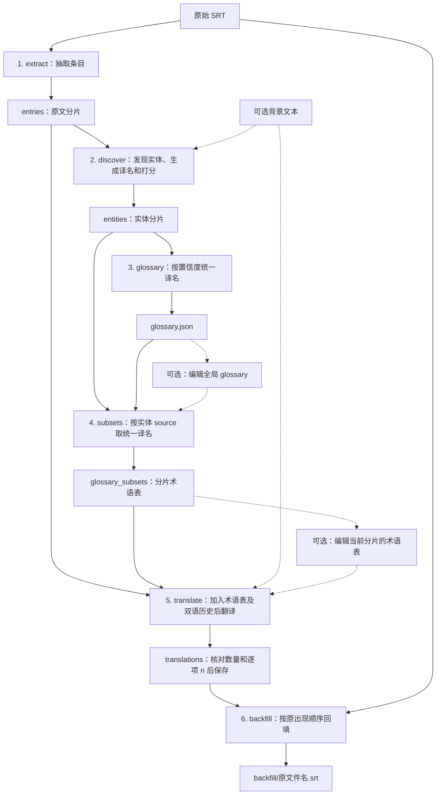

# SRT 字幕翻译工具

一个 Python 命令行工具，通过 OpenAI Compatible API（兼容 OpenAI Chat Completions 接口）翻译 SRT，先统一实体译名，再逐片翻译和回填。每次处理一个文件，所有请求同步、串行、非流式执行。

源语言必填，目标语言默认为 `zh-Hans`（简体中文）。中间产物都是可编辑的 JSON，可在任意阶段停止、修改后继续。详细设计见 [PLAN.md](PLAN.md)。

## 安装

需要 Python 3.11 或更高版本。在项目根目录中执行 PowerShell 命令；已有可用 `.venv` 时跳过创建：

```powershell
python -m venv .venv
.\.venv\Scripts\Activate.ps1
```

选择一种安装方式：

| 用途 | 命令 | 修改源码后 |
| --- | --- | --- |
| 开发或个人维护，推荐 | `python -m pip install -e .` | 通常直接生效；依赖或入口配置变化后需重新安装 |
| 普通安装 | `python -m pip install .` | 需重新安装 |
| 开发并运行测试 | `python -m pip install -e ".[dev]"` | 同可编辑安装 |

激活环境后，两种入口行为一致：

```powershell
srt-translate --help
python -m srt_translate --help
```

也可以直接使用虚拟环境的解释器：

```powershell
.\.venv\Scripts\python.exe -m pip install -e ".[dev]"
.\.venv\Scripts\python.exe -m srt_translate --help
```

## 快速开始

先确认所配置的 OpenAI Compatible API 服务可访问。API 参数通过 `config.toml` 配置，文件位置和覆盖规则见下文“API 配置与失败行为”。

英文翻译为简体中文，连续运行六个阶段：

```powershell
srt-translate "examples/Blood.of.Zeus.S01E01.srt" --source-lang en
```

日文翻译为英文，指定输出父目录：

```powershell
srt-translate "examples/1997 スペシャルおまけビデオ.srt" --source-lang ja --target-lang en --output-dir outputs
```

输出父目录默认为当前工作目录，程序始终在其中生成 `<原文件主名>__<源语言>_to_<目标语言>/` 任务目录。例如，第一条命令的最终文件是：

```text
Blood.of.Zeus.S01E01__en_to_zh-Hans/backfill/Blood.of.Zeus.S01E01.srt
```

省略 `--output-dir` 与指定 `--output-dir ./` 等价：

```powershell
srt-translate "examples/Blood.of.Zeus.S01E01.srt" --source-lang en --to-stage extract
srt-translate "examples/Blood.of.Zeus.S01E01.srt" --source-lang en --to-stage extract --output-dir ./
```

`--output-dir PATH` 指定输出父目录，任务目录名由程序追加。所有相对路径基于当前工作目录。不同目录中的同名 SRT 使用相同语言组合时，会得到同一任务目录；请指定不同的输出父目录来分开。

## 六阶段流程



| 阶段与模块 | 输入和职责 | 输出 |
| --- | --- | --- |
| `extract` / `phase_extract_entries.py` | 解析 SRT，按出现顺序分片，保留原编号 | `entries/*.json` |
| `discover` / `phase_discover_entities.py` | 逐片请求模型，抽取名称、分类、生成目标语言译名和三项置信度 | `entities/*.json` |
| `glossary` / `phase_build_glossary.py` | 按 source 原字符串分组，选择三项置信度平均分最高的候选；同分保留最早候选 | `glossary.json` |
| `subsets` / `phase_generate_glossary_subsets.py` | 从每片实体取 source、去重排序，从全局 glossary 复制译名 | `glossary_subsets/*.json` |
| `translate` / `phase_translate.py` | 读取原文、同名子集、双语历史，翻译并核对条目数量及逐项 n | `translations/*.json` |
| `backfill` / `phase_backfill.py` | 按译文分片顺序替换原字幕正文，保留原编号、时间和顺序 | `backfill/<原文件名>` |

其他模块：`cli.py` 负责参数和调度；`config.py` 加载和校验分层 API 配置；`common.py` 负责文件读写；`schemas.py` 定义响应 Schema；`prompts.py` 保存提示词；`llm.py` 负责等待、同步请求和 JSON 解析。各阶段不直接调用其他阶段，可按 PLAN.md 的接口独立调用。

同一分片在各目录使用相同文件名：

```text
Blood.of.Zeus.S01E01__en_to_zh-Hans/
├── entries/000001_000020.json
├── entities/000001_000020.json
├── glossary.json
├── glossary_subsets/000001_000020.json
├── translations/000001_000020.json
└── backfill/Blood.of.Zeus.S01E01.srt
```

文件名表示从 1 开始的条目位置，不是字幕编号。数字宽度为 `max(6, len(str(total_entries)))`。例如原编号为 10、20、35，分片大小为 2 时，文件名为 `000001_000002.json` 和 `000003_000003.json`，文件内 `n` 仍为 10、20、35。

原文和译文分片是 `[{"n": 10, "text": "正文"}]` 数组；实体分片是实体数组；全局 glossary 和子集是原词到译名的对象。实体数组和术语表都允许为空。

### 运行进度

各阶段逐片显示文件名和 `当前分片/总分片数`，跳过的分片也计入进度。例如：

```text
[discover] 1/4 processing: 000001_000020.json
[discover] 1/4 done: 000001_000020.json
[discover] 2/4 skipped (exists): 000021_000040.json
[discover] 3/4 processing: 000041_000060.json
```

`discover` 和 `translate` 在等待及模型调用前输出 `processing`，成功保存后输出 `done`。已有产物显示 `skipped (exists)`；本地抽取和子集生成显示 `done`，glossary 汇总和回填显示已读取分片的 `read`。日志逐行即时刷新，阶段结束时仍显示产物汇总。

## CLI 参数

```text
srt-translate INPUT_SRT --source-lang LANG [--target-lang LANG] [OPTIONS]
```

| 参数 | 默认值 | 说明 |
| --- | --- | --- |
| `INPUT_SRT` | 必填 | 原始 SRT 路径，各阶段都需要提供此参数 |
| `--source-lang LANG` | 必填 | 源语言的 BCP 47 标签，如 `en`、`ja`、`fr`、`ar` |
| `--target-lang LANG` | `zh-Hans` | 目标语言标签，如 `en`、`zh-Hant`、`pt-BR` |
| `--background PATH` | 不提供 | UTF-8 背景文本，可含作品背景和文风参考，通常约 100 token |
| `--output-dir PATH` | 当前工作目录 | 输出父目录；始终在其下生成 `<stem>__<source_lang>_to_<target_lang>/` 任务目录 |
| `--config-file PATH` | 不提供 | 按字段覆盖内置配置和用户配置，优先级最高 |
| `--input-encoding NAME` | `utf-8-sig` | 原 SRT 解码方式 |
| `--chunk-size N` | `20` | 正整数，仅在抽取阶段使用 |
| `--history-size N` | `5` | 前文双语历史条数，非负整数；0 禁用历史 |
| `--no-translate-glossary` | 不启用 | 保留当前子集所有术语的原词 |
| `--delay-between-requests SECONDS` | `0` | 每次模型调用前的等待秒数，非负有限数，支持小数 |
| `--from-stage NAME` | `extract` | 起始阶段，包含该阶段 |
| `--to-stage NAME` | `backfill` | 结束阶段，包含该阶段 |
| `-h` / `--help` | — | 显示帮助 |

阶段顺序为 `extract → discover → glossary → subsets → translate → backfill`。起始阶段不能晚于结束阶段。程序只执行所选区间，不补跑前置阶段。

语言标签只检查非空及 ASCII 字母、数字和连字符，不限制语言列表，也不做完整 BCP 47 校验。标签原样传给模型，并用于任务目录名。`zh-Hans` 明确表示简体中文；`zh-Hant` 表示繁体中文；需要简体字和中国大陆用语时可指定 `zh-Hans-CN`。实际翻译质量取决于模型。

```powershell
srt-translate input.srt --source-lang fr --target-lang pt-BR
srt-translate input.srt --source-lang en --target-lang zh-Hant
srt-translate input.srt --source-lang en --target-lang zh-Hans-CN --background background.txt
```

## 检查、编辑与续跑

先生成全局 glossary，检查或修改后再继续：

```powershell
srt-translate input.srt --source-lang en --to-stage glossary
# 编辑当前任务目录中的 glossary.json
srt-translate input.srt --source-lang en --from-stage subsets
```

只生成子集，逐片编辑后继续翻译：

```powershell
srt-translate input.srt --source-lang en --from-stage subsets --to-stage subsets
# 编辑 glossary_subsets 中的文件
srt-translate input.srt --source-lang en --from-stage translate
```

续跑时保持语言、背景和输出目录等参数一致。已有需要更新的下游文件时，先按下表清理。

### 三种术语用法

1. **使用词典译名**：默认将子集作为 `glossary` 传给模型。
2. **保留个别原词**：在全局 glossary 或单片子集中设置相同键值，如 `"Alexia": "Alexia"`。
3. **统一保留原词**：指定 `--no-translate-glossary`，请求只携带子集键组成的 `do_not_translate_terms`，不传 `glossary`。

```json
{
  "Alexia": "Alexia",
  "Elias": "伊莱亚斯"
}
```

默认模式的提示词要求原样采用词条的值，即使它与目标语言不同。统一保留原词时，其他正文仍正常翻译：

```powershell
srt-translate input.srt --source-lang en --from-stage translate --no-translate-glossary
```

实体发现始终生成目标语言的建议译名，不受这个开关影响。实体含 `source`、`context`、英文 `reasoning`、开放的 `type` 和 `subtype`、`translation` 及三项 0～1 置信度。全局 glossary 不设置最低分门槛，不合并大小写、空白变体、别名或长短词。

### 子集覆盖与历史

子集根据实体分片中的 source 生成，不重新扫描原文。实体漏抽的词不会自动进入当前子集，即使全局 glossary 中已有该词；可直接补到当前子集。仅在全局 glossary 新增词条，不会使没有对应实体的分片自动使用它。删除仍被实体引用的全局键会在生成子集时导致普通字典访问错误。

翻译阶段直接使用人工编辑的子集，允许添加新词或覆盖译名。双语历史取当前分片之前紧邻的最后 N 条字幕，必要时跨多个分片，按原出现顺序排列，并通过 n 查找对应译文。已复用的译文也可进入历史；第一片及 N=0 时历史为空。

新译文只有在数量、顺序和逐项 n 与当前原文一致后才会保存。失败立即停止，该响应不落盘，也不会进入后续历史。已有译文不重复检查。修改子集后产生的新译文，或直接编辑的译文，可能通过历史影响后续用词；如需让后续分片采用新历史，也要删除后续旧译文后再生成。

### 文件存在即跳过

只检查目标文件是否存在，不为决定跳过而读取或校验内容。人工编辑会保留；损坏文件在后续实际被读取时才报错。抽取阶段仍需解析原 SRT 以确定分片。

各阶段只处理实际存在的输入分片，不保证发现上游缺片。例如 entries 有 15 片、entities 有 14 片时，构建 glossary 只汇总现有 14 片。翻译某个 entries 分片时，必须读取其同名子集；缺失会报错，内容为 `{}` 则有效。回填按已有译文位置替换正文，不再次核对数量、顺序或编号；缺少所需位置的数据时按普通读取错误停止。

程序按需创建目录，不自动删除、修复或使产物失效。清理范围由用户决定，重新生成会丢失该产物的人工编辑。下表中“旧 SRT”指当前任务 `backfill/` 中的产物。

| 修改内容 | 清理与续跑 |
| --- | --- |
| 原 SRT、输入编码、分片大小 | 清空当前任务目录重新运行，或换输出父目录 |
| 源语言或目标语言 | 新语言组合生成新任务目录，从 `extract` 完整运行；显式指定父目录时也一样 |
| 背景、模型、实体抽取提示词 | 删除 entities、glossary.json、glossary_subsets、translations 和旧 SRT，从 `discover` 继续 |
| entries 中的正文 | 同上，从 `discover` 继续 |
| entities，需要重新选择全局译名 | 删除 glossary.json、glossary_subsets、translations 和旧 SRT，从 `glossary` 继续 |
| glossary.json | 删除 glossary_subsets、translations 和旧 SRT，从 `subsets` 继续 |
| 某个 glossary 子集 | 保留编辑后的子集；删除 translations 和旧 SRT，从 `translate` 继续 |
| 术语开关、history 大小、翻译提示词 | 删除 translations 和旧 SRT，从 `translate` 继续 |
| translations | 删除旧 SRT，从 `backfill` 继续 |
| 最终 SRT | 保留编辑后的文件即可 |

编辑 entries 或 translations 时，应保持条目数量、顺序和 n 与原 SRT 对应。切换目标语言也会影响实体译名和子集，需要按上表重建。只重新回填的命令：

```powershell
# 先删除当前任务 backfill 中的旧 SRT
srt-translate input.srt --source-lang en --from-stage backfill
```

## 编码与字幕格式

- 原 SRT 默认以 `utf-8-sig` 读取，兼容带 BOM 和不带 BOM 的 UTF-8。其他编码用 `--input-encoding` 指定，例如 `--input-encoding gb18030`。
- 背景文件始终以 `utf-8-sig` 读取，未提供时传空字符串。
- 输出全部为无 BOM 的 UTF-8。JSON 保留 Unicode 字符、两空格缩进、LF 文件换行；正文换行在 JSON 字符串中转义为 `\n`。
- SRT 输出为 CRLF，通过 `srt.compose(reindex=False, strict=True, eol="\r\n")` 保留原编号和顺序，清理影响 SRT 块结构的空白行。
- 不修改原文件。译文可按目标语言改变每条字幕的行数和换行位置。
- 提示词要求逐字保留 URL、HTML 标签及属性、ASS 控制块和音乐符号，并翻译标签间、控制块外的可见文本；方括号内的正文按语境翻译。这些内容的保留依靠模型和人工检查。

## API 配置与失败行为

项目名、发行名、CLI 工具名和用户配置目录名使用 `srt-translate`；Python 模块名使用 `srt_translate`。配置文件在包内或用户配置目录内，分别命名为 `config.default.toml` 和 `config.toml`。

配置为 UTF-8 TOML，只有 `[openai]` 表及以下四个字段。内置基础默认值位于随应用打包的 [config.default.toml](src/srt_translate/config.default.toml)：

```toml
[openai]
base_url = "http://127.0.0.1:8317/v1"
api_key = "123456"
model = "gemini-3.8-flash-high"
max_retries = 2
```

配置按字段依次加载，后者只覆盖自己声明的字段：

| 优先级 | 来源 |
| --- | --- |
| 低 | 应用资源内的 `config.default.toml` |
| 中 | `user_config_path("srt-translate", appauthor=False) / "config.toml"` |
| 高 | `--config-file PATH` 指定的文件 |

用户配置路径由 [platformdirs](https://platformdirs.readthedocs.io/en/latest/api.html#platformdirs.user_config_path) 按系统确定。可用下列命令查看实际路径，再自行创建文件：

```powershell
python -c "from platformdirs import user_config_path; print(user_config_path('srt-translate', appauthor=False) / 'config.toml')"
```

覆盖文件可以只写要修改的字段。例如用户文件只写 `api_key`，显式文件只写 `model`，最终保留用户的 `api_key` 和显式文件的 `model`，其他字段沿用内置值。

```powershell
srt-translate input.srt --source-lang en --config-file ./config.toml
```

配置文件路径相对于当前工作目录解析。程序不会自动寻找当前目录中的配置；需要用 `--config-file` 指定。用户配置不存在时直接使用其他层，不自动创建文件；显式文件不存在则报错。

每层配置在任何阶段执行前严格校验，包括仅运行 `extract` 的情况；语法错误、未知表或字段、类型错误都会报告文件路径并以退出码 2 停止，不生成任务产物。前三项必须为非空字符串，`max_retries` 必须为非负整数；更高优先级文件不能掩盖低优先级文件中的错误。`--help` 不加载配置。

`max_retries` 传给 OpenAI SDK；使用 SDK 默认超时。请求使用 `client.chat.completions.create` 和 `stream=False`，不额外设置 temperature、top_p 或推理预算。所用 API 服务及模型需支持 [OpenAI 结构化输出](https://developers.openai.com/api/docs/guides/structured-outputs) 的 `json_schema` 格式。Pydantic 用于配置校验及生成严格响应 Schema；正常模型响应不重复做本地 Schema 校验。

实体响应顶层为 `{"entities": [...]}`，译文响应为 `{"entries": [...]}`，解包后的数组保存到文件。只有正常以 `stop` 结束、没有 refusal 且有文本的响应才会解析。JSON 错误、必要字段无法读取、文件读写错误、新译文数量或编号不一致，以及 SDK 重试后仍失败，都会报告阶段和相关路径并停止。此前写入的产物保留，修正或删除相关文件后可续跑。

可以在每次模型调用前等待：

```powershell
srt-translate input.srt --source-lang en --delay-between-requests 1.5
```

实体发现和翻译共用此设置，第一次调用前也等待；默认 0 不等待，复用产物不等待。此参数作用于每次程序发起的 SDK 调用，不控制 SDK 内部重试。程序没有额外的业务重试。

## 测试

安装开发依赖后，默认仅运行单元和假客户端集成测试，不发送 API 请求：

```powershell
python -m pytest
```

测试覆盖分片、编码、glossary 选择和子集、历史、数量与编号核对、文件复用、CLI、配置覆盖与错误处理、两个安装入口及完整六阶段流程。配置测试和 CLI 测试隔离用户配置路径；等待测试替换 sleep，不真实等待。

显式运行真实 API 测试：

```powershell
python -m pytest tests/live
```

真实测试加载内置配置和实际用户配置，分别检查英文到简体中文、日文到英文，以少量字幕跑完六阶段。每次创建带微秒时间戳的新目录：

```text
test_outputs/live/<run_id>/<case_name>/
├── input.srt
├── background.txt
└── outputs/
    └── input__<source_lang>_to_<target_lang>/
        ├── entries/
        ├── entities/
        ├── glossary.json
        ├── glossary_subsets/
        ├── translations/
        └── backfill/input.srt
```

每个用例显式使用自己的 `outputs/` 作为输出父目录，由 CLI 追加任务目录名，保证不会因旧产物而跳过模型调用。成功或失败后均保留文件，测试结束时显示产物路径；`test_outputs/` 已加入 Git 忽略列表。测试检查结构、编号和时间，不断言固定译法；译文语言、名称处理和可读性需抽查。

仓库样例在默认 `chunk_size=20` 下的结果：

| 样例 | 条目数 | 分片数 | 最后分片 |
| --- | --- | --- | --- |
| `Blood.of.Zeus.S01E01.srt` | 284 | 15 | `000281_000284.json` |
| `1997 スペシャルおまけビデオ.srt` | 63 | 4 | `000061_000063.json` |

英文样例带 UTF-8 BOM，包含 59 条多行字幕；日文样例不带 BOM。
