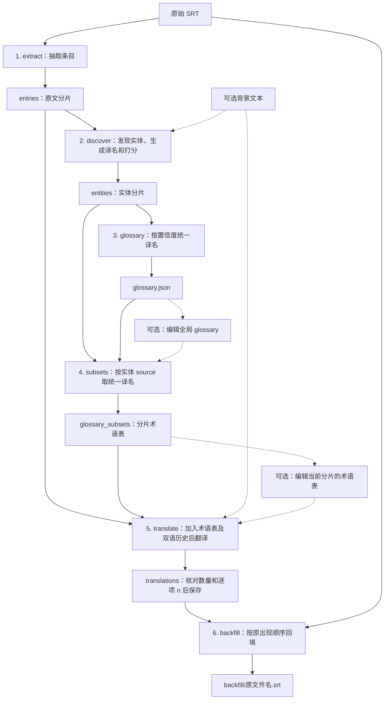

# SRT 字幕翻译工具

通过 OpenAI Compatible API 翻译 SRT 字幕，支持统一术语、人工校对和分阶段续跑。源语言必填，默认译为简体中文（`zh-Hans`），原字幕文件保持不变。详细设计见 [PLAN.md](PLAN.md)。

## 六阶段流程



## 安装

需要 Python 3.11 或更高版本。在项目根目录创建并激活虚拟环境（PowerShell）：

```powershell
python -m venv .venv
.\.venv\Scripts\Activate.ps1
```

选择一种安装方式：

| 方式 | 命令 | 说明 |
| --- | --- | --- |
| 普通安装 | `python -m pip install .` | 用于运行工具 |
| 开发安装 | `python -m pip install -e ".[dev]"` | 可编辑安装，包含测试依赖 |

安装后可运行 `srt-translate --help` 查看帮助。

## 配置

API 服务及模型需支持 OpenAI Chat Completions 和 `json_schema` 结构化输出。在 UTF-8 编码的 `config.toml` 中填写 API 参数。以下为内置默认值，请按服务提供的信息修改：

```toml
[openai]
base_url = "http://127.0.0.1:8317/v1"
api_key = "123456"
model = "gemini-3.8-flash-high"
max_retries = 2
```

`max_retries` 为 API 请求的最大重试次数，必须是非负整数。使用指定配置文件：

```powershell
srt-translate input.srt --source-lang en --config-file ./config.toml
```

配置按字段叠加，后者只覆盖自己填写的字段：

| 优先级 | 来源 |
| --- | --- |
| 低 | 应用内置的 [config.default.toml](src/srt_translate/config.default.toml) |
| 中 | 系统用户配置目录中的 `srt-translate/config.toml` |
| 高 | `--config-file PATH` 指定的文件 |

用户配置文件可自行创建，以下命令显示其完整路径：

```powershell
python -c "from platformdirs import user_config_path; print(user_config_path('srt-translate', appauthor=False) / 'config.toml')"
```

程序不会自动读取当前目录中的 `config.toml`，需用 `--config-file` 指定。用户配置文件不存在时跳过；显式指定的文件缺失，或配置存在语法、类型及未知字段错误时，会在运行前报错。

## 使用

### 典型用法

英文翻译为简体中文：

```powershell
srt-translate "examples/Blood.of.Zeus.S01E01.srt" --source-lang en
```

日文翻译为英文，并指定输出父目录：

```powershell
srt-translate "examples/1997 スペシャルおまけビデオ.srt" --source-lang ja --target-lang en --output-dir outputs
```

提供作品背景和文风参考：

```powershell
srt-translate input.srt --source-lang en --background background.md
```

输出父目录默认为当前工作目录，等价于 `--output-dir ./`。程序自动在其中创建 `<stem>__<source_lang>_to_<target_lang>/` 任务目录。第一条命令的最终字幕位于：

```text
Blood.of.Zeus.S01E01__en_to_zh-Hans/backfill/Blood.of.Zeus.S01E01.srt
```

所有相对路径基于当前工作目录。同名字幕使用相同语言组合时，请指定不同的输出父目录以区分任务。

### CLI 参数

```text
srt-translate INPUT_SRT --source-lang LANG [--target-lang LANG] [OPTIONS]
```

| 参数 | 默认值 | 说明 |
| --- | --- | --- |
| `INPUT_SRT` | 必填 | 原始 SRT 路径，各阶段均需提供 |
| `--source-lang LANG` | 必填 | 源语言标签，如 `en`、`ja`、`fr` |
| `--target-lang LANG` | `zh-Hans` | 目标语言标签，如 `en`、`zh-Hant` |
| `--background PATH` | 不提供 | UTF-8 背景文本，无扩展名限制 |
| `--output-dir PATH` | 当前工作目录 | 输出父目录，任务目录名自动追加 |
| `--config-file PATH` | 不提供 | 配置覆盖文件，优先级最高 |
| `--input-encoding NAME` | `utf-8-sig` | 原 SRT 编码，默认兼容带 BOM 和不带 BOM 的 UTF-8 |
| `--chunk-size N` | `20` | 每片字幕条数，正整数 |
| `--history-size N` | `5` | 参考的前文双语字幕条数，`0` 禁用 |
| `--no-translate-glossary` | 不启用 | 保留当前分片术语表中所有术语的原词 |
| `--delay-between-requests SECONDS` | `0` | 每次模型调用前的等待秒数，含第一次；支持非负小数 |
| `--from-stage NAME` | `extract` | 起始阶段，包含该阶段 |
| `--to-stage NAME` | `backfill` | 结束阶段，包含该阶段 |
| `-h` / `--help` | — | 显示帮助 |

阶段顺序为 `extract → discover → glossary → subsets → translate → backfill`。程序只执行所选区间，不补跑前置阶段。

### 检查、编辑与续跑

先生成全局术语表，检查或修改后继续：

```powershell
srt-translate input.srt --source-lang en --to-stage glossary
# 编辑任务目录中的 glossary.json
srt-translate input.srt --source-lang en --from-stage subsets
```

也可以停在分片术语表阶段，逐片调整后再翻译：

```powershell
srt-translate input.srt --source-lang en --to-stage subsets
# 编辑任务目录中 glossary_subsets/ 下的文件
srt-translate input.srt --source-lang en --from-stage translate
```

术语表采用 `"原词": "译名"` 格式；若需保留个别原词，将键和值设为相同，例如 `"Alexia": "Alexia"`。

任务中断后，重新运行原命令即可续跑。已有产物会跳过，修改上游内容不会自动更新后续产物。需要重新生成时，按下表处理；删除产物会丢失其中的人工编辑。表中路径均相对于任务目录。

| 修改内容 | 处理方式 | 续跑起点 |
| --- | --- | --- |
| 原 SRT、输入编码或分片大小 | 使用新的输出父目录 | `extract` |
| 背景或模型 | 删除 `entities/`、`glossary.json`、`glossary_subsets/`、`translations/`、`backfill/` | `discover` |
| `glossary.json` | 删除 `glossary_subsets/`、`translations/`、`backfill/` | `subsets` |
| 分片术语表、术语开关或历史条数 | 删除 `translations/`、`backfill/` | `translate` |
| `translations/` 中的译文 | 删除 `backfill/` | `backfill` |

续跑时保持输入、语言、配置、背景和输出父目录等参数一致。编辑译文时保留条目数量、顺序和 `n`（字幕编号）。例如，只重新回填已编辑的译文：

```powershell
# 先删除当前任务目录中的 backfill/
srt-translate input.srt --source-lang en --from-stage backfill
```

## 测试

完成开发安装后，运行默认测试，不发送 API 请求：

```powershell
python -m pytest
```

真实 API 测试使用内置配置和系统用户配置，并保留产物至 `test_outputs/live/`：

```powershell
python -m pytest tests/live
```
